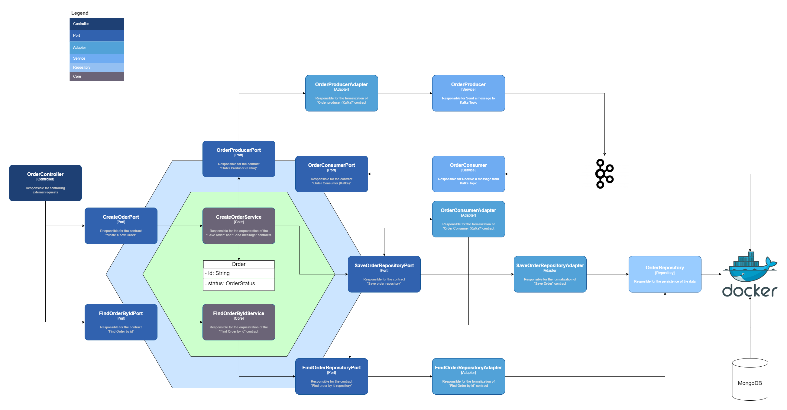

## Desafio

Construir uma pequena aplicação de acordo com os seguintes requisitos:
Stack a ser utilizada:
- Spring Boot
- Apache Kafka
- MongoDB
- Java 17
- Maven

Para a construção do Microsserviço deve ser utilizada a arquitetura Hexagonal.

A partir do arquivo docker-compose fornecido crie um pequeno sistema de pedidos que irá funcionar de forma assíncrona. Utilize Spring Boot, Java 17 e Maven.
Considere que o sistema terá duas partes, uma responsável pela criação e consulta de pedidos e outra que será responsável pelo processamento do pedido e envio dos dados para a transportadora que enviará o pedido ao cliente.

O sistema deve conter endpoints REST para criação e também para consulta do STATUS de um pedido. Os possíveis status são AGUARDANDO_ENVIO e ENVIADO_TRANSPORTADORA

Assim que um pedido é efetuado, os dados do pedido devem ser gravados em uma collection no Mongo com o status AGUARDANDO_ENVIO
e uma mensagem deve ser postada em um tópico Kafka informando que um novo pedido foi efetuado.

Deve existir um consumidor para esse tópico Kafka que seja capaz de ler os dados, realizar a busca desse pedido no Mongo e alterar o status do mesmo para ENVIADO_TRANSPORTADORA.

Ao consultar o pedido através do endpoint de consulta, ele deve retornar o pedido com o status devidamente atualizado.

Para fins de simplificação tanto o producer quanto o consumer podem ser implementados em um único Microsserviço.


Esse projeto foi feito para explicar melhor sobre a arquitetura Hexagonal, podendo ter sido feito com qualquer outra linguagem ou framework.

## Para subir a aplicação

Suba os componentes do Docker, utilizando o seguinte comando:
```shell script
docker-compose up -d
```
Em seguida suba a aplicação localmente, utilizando a sua IDE, ou CLI de sua preferência:
```
mvn spring-boot:run
```
Após isto, utilize o Postman para fazer requisições no endpoint "localhost:8080/orders"

## Arquitetura de Solução

A imagem abaixo é a arquitetura de solução proposta para este teste


